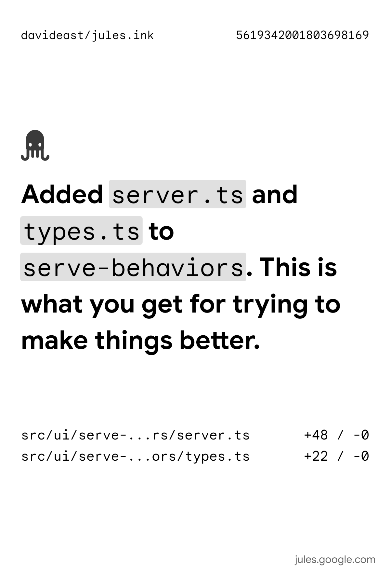

# Jules Ink 🖨️

**Print physical labels of your AI coding sessions.** Jules Ink connects to [Jules](https://jules.google.com) sessions, generates AI-powered summaries, and prints them to thermal label printers.



## Why?

Because watching an AI write code is cool. But having a **physical artifact** of what it did? That's cooler.

- 📝 **Document your AI pair programming** — Keep a tangible record of what Jules built
- 🎉 **Make it fun** — Print summaries as a pirate, Shakespeare, or a noir detective
- 🏷️ **Label your commits** — Stick them on your monitor, notebook, or fridge

## Quick Start

```bash
# Install dependencies
npm install

# Set your API key
export GEMINI_API_KEY="your-key"
export JULES_API_KEY="jules-key"

jules-ink process --session <SESSION_ID> -t haiku
```

## CLI Options

```
Usage: jules-ink process [options]

Options:
  -s, --session <id>    Session ID to process (required)
  -m, --model <name>    Gemini model (default: "gemini-2.5-flash-lite")
  -t, --tone <preset>   Tone for summaries (default: "professional")
  -p, --printer <name>  Printer name (auto-discovers if not set)
  -h, --help            Display help
```

## Tone Presets

Make your labels fun with built-in tone presets:

| Tone | Example Output |
|------|----------------|
| `professional` | "Refactoring `SessionClient` to support new handshake protocol." |
| `pirate` | "Arr! We be refactorin' the `SessionClient`, matey!" |
| `shakespearean` | "Hark! The `SessionClient` doth receive new methods most fair." |
| `excited` | "OMG!! 🎉 Just refactored `SessionClient`!!! SO EXCITING!!! 🚀" |
| `haiku` | "Code flows like a stream / SessionClient transforms / Bugs fade to nothing" |
| `noir` | "The function had seen better days. I gave it a new life." |

### Custom Tones

Pass any string to `-t` for a custom tone:

```bash
# Characters
jules-ink process -s 123456 -t "Respond as if you're a grumpy cat"
jules-ink process -s 123456 -t "Write like a sports commentator at a tied match in extra time"
jules-ink process -s 123456 -t "Write like a nature documentary narrator observing code in its natural habitat"
jules-ink process -s 123456 -t "Respond like a dramatic movie trailer voiceover"
jules-ink process -s 123456 -t "Write as a medieval herald announcing royal decrees"

# Professions & styles
jules-ink process -s 123456 -t "Write like a sports commentator at a tied match in extra time"
jules-ink process -s 123456 -t "Respond as a surfer dude who just discovered coding"
jules-ink process -s 123456 -t "Write like a food critic reviewing a gourmet meal"
jules-ink process -s 123456 -t "Respond as an overly enthusiastic infomercial host"
jules-ink process -s 123456 -t "Respond like a soap opera actor"

# Moods & vibes
jules-ink process -s 123456 -t "Write with the energy of someone who just had 5 espressos"
jules-ink process -s 123456 -t "Respond like a wise grandparent telling stories by the fire"
jules-ink process -s 123456 -t "Write as if you're whispering secrets at a library"
jules-ink process -s 123456 -t "Respond with the dramatic flair of a telenovela narrator"
```

## Use Cases

### 1. Physical Commit Log

Print a label for each coding session and stick them in a notebook:

```bash
jules-ink process -s 561934200180369816 at a tied match in extra time9
jules-ink process -s 5619342001803698169
```

### 2. Fun Team Activity

Have Jules write code, then print the summary as a haiku:

```bash
jules-ink process -s 5619342001803698169 -t haik at a tied match in extra timeu
jules-ink process -s 5619342001803698169 -t haiku
```

## Printer Setup

Jules Ink works with thermal label printers via CUPS. The default target is `PM-241-BT` (a common Bluetooth thermal printer).

If no printer is found, labels are saved to `output/<session-id>/` as PNG files.

## Requirements

- Node.js 18+
- `GEMINI_API_KEY` environment variable
- `JULES_API_KEY` environment variable
- (Optional) Thermal label printer

## License

MIT
